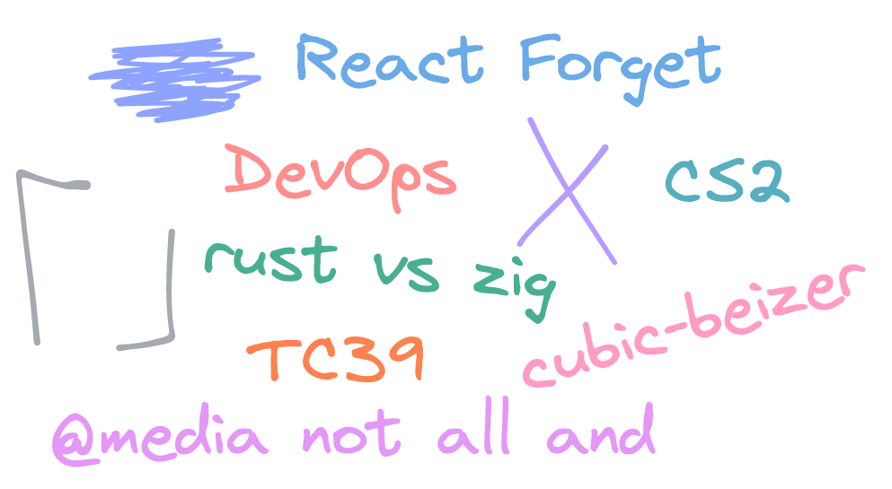

  

# Ссылок много не бывает

## https://twitter.com/ItsSimonTime/status/1636857478263750656

Встроенная рисовалка на скриншотах в Google Pixel оказывается позволяет раскропать изображение и частично восстановить отредактированное изображение. Параноик и делаешь второй скриншот когда что-то редактируешь? Тебе повезло. Дежавю? Похожее [уже случалось с GIMP и Preview](https://twitter.com/wdormann/status/1215746766659837953).

Edit: пока я собирал ссылки, оказалось, что и виндовый Snipping Tool вступил в ряды acropalyps-а и не умеет нормально обрезать скриншоты. [Читай подробнее здесь](https://twitter.com/David3141593/status/1638222624084951040)

---

## https://devopscube.com/become-devops-engineer

Каждый из нас немного девопс, а мне на глаза попался огромный гайд о том, что в этой профессии в 2023 году полезно знать и как не сойти с ума от страшных аббревиатур и сокращений.

---

## https://epicreact.dev/why-you-shouldnt-put-refs-in-a-dependency-array/

Массив зависимостей `useEffect` покрыт тайнами и мифами. Kent C. Dodds в статье расскажет почему не рефы (и не только) не нужно добавлять в зависимости.

---

## https://joshcollinsworth.com/blog/great-transitions

Меня бесят анимации. Не потому что я люблю статический контент, который резко меняется, а потому что анимации часто не умеют готовить. Мастшабы проблем бывают разные: от менюшек, которые начинают куда-то ехать при наведении и анимаций, задерживающих действия (привет Apple) до тотального бардака и мечты эпилептика (лучи поноса авторам телеграма для iOS). В статье 10 советов как сделать веб анимации лучше.

---

## https://twitter.com/tesseralis/status/1637759687683878912

Оказывается чтобы получить противоположное медиа выражение не достаточно просто приписать not.

---

## https://twitter.com/tagir_valeev/status/1637771926348132352

Знаешь регулярки? Я тоже не знаю, и `"aaaa".replaceAll(".*", "#")` стало для меня сюрпризом.

---

## https://twitter.com/github/status/1638541174611779584

Copilot оброс новой функциональностью, теперь с ним можно початиться прямо в IDE, описать PR, почитать чьи-то доки и даже спросить какие там аргументы у tar-а или ffmpeg-а.

---

## https://twitter.com/SaeedDiCaprio/status/1638248160597364736

Гугл пытается остаться полезным и открыли на публику Bard, их аналог ChatGPT. К счастью нашу работу он пока не заменит, да и вообще больше похож на поделку Google Summer Camp чем на новый SkyNet.

---

## https://evanw.github.io/thumbhash/

Знаешь о BlurHash? Это такая библиотечка чтобы генерировать легкие плейсхолдеры к тяжелым изображениям. А тут автор ESBuild сделал свою версию. Моему глазу картинки из ThumbHash нравятся гораздо больше.

---

## https://react.dev/blog/2023/03/22/react-labs-what-we-have-been-working-on-march-2023

Экспериментальная подкоманда реакта поделилась постом о своих наработках. Поможет ли React Forget автоматически починить косяки мемоизации или это очередная попытка сохранить постаревшую ментальную модель о которой можно будет скоро забыть? Я настроен скептически, и думаю, что сохранить простую модель, но придумать сложную и непонятную абстракцию сверху (напоминает хуки, да?) это странный путь к решению проблем. Нет ничего страшного в моделях посложнее, а притворяться, что текущая модель идеальна и не течет со всех сторон просто странно.

---

## https://zackoverflow.dev/writing/unsafe-rust-vs-zig/

Я в лагере переписывателей всего на Rust, но иногда Zig может оказаться удобнее (например если у тебя много интеграций с C). Не умеешь читать? Вот видео-реакция: https://youtu.be/CbQVR4v5PZw

---

## https://twitter.com/CounterStrike/status/1638582094640328705

Counter Strike 2. Может быть и до Java Script 2 доживу.

---

## https://twitter.com/robpalmer2/status/1639042932559970304

Продуктивная встреча TC39: Import Assertions вернулись в stage 3 под новым именем, AsyncContext, декораторы для параметров методов, Iterator.range(), и другое.
