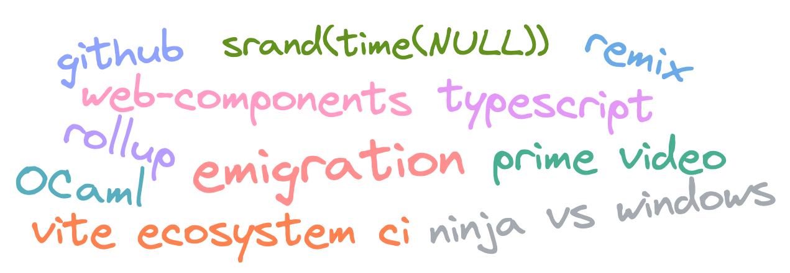

  

# Неделя пролетела незаметно, пора и ссылками поделиться

## https://blog.davetcode.co.uk/post/21st-century-emulator/

Что происходит, когда разработчик применяет современные принципы разработки софта там, где не стоит? Получается эмулятор работающий на микросервисах в кубере.

---

## https://twitter.com/justinfagnani/status/1654513358245363713

Веб компоненты ближе чем ты думаешь, chrome и edge уже давно используют их для своего UI, вот и firefox засветились.

---

## https://twitter.com/patak_dev/status/1654132862847963139

Когда разрабатываешь какую-то очень базовую штуку, от которой много кто зависит и которая часто меняется без каких-то тестов совместимости не обойтись. Вот у vite (и друзей) есть свой публичный CI для всех пакетов, что зависят от него.

---

## https://habr.com/ru/articles/733738/

Ты мог заметить, что среди этих ссылок редко встречается что-то на русском. В этот раз повезло, Фил написал поток мыслей об эмиграции, коммьюнити и планах на будущее.

---

## https://twitter.com/Rich_Harris/status/1655262910510256130

С возвращением популярности «просто пиши sql» возвращается и вопрос: а можно ли добавить немного типизации?

---

## https://twitter.com/AdamRackis/status/1655275288203337731

С tailwind легко запутаться в динамических классах и вариантах, вот небольшой пример того, что может быть динамичным, а что — нет.

---

## https://gist.github.com/bluwy/520fe8d8a018078640b1e9d02885243c

Чем больше используют vite тем больше используют и rollup (ты же знаешь, что бандлит в конце концов он, а не esbuild?). К сожалению на больших проектах у rollup (а транзитивно у vite) есть проблемы с памятью. По ссылке — потенциал оптимизаций.

---

## https://twitter.com/dhh/status/1655076668787097607

Не встречай своих кумиров. dhh с даже не горячим, а просто глупым тейком. Типизация это хорошо (даже в питоне это поняли), а вот синтаксис и компилятор ts уже может быть не очень.

К сожалению, typescript это продукт от microsoft и он, как и другие их проекты страдает «синдромом c++». За ts (да и за vscode с github-ом) стоит команда, которая продолжает добавлять все больше и больше фич, даже если они тебе не нужны. Через десяток лет ts обрастет таким количеством барахла, что пользоваться им уже будет невозможно.

Надеюсь к тому времени примут [пропоузал с аннотациями внутри js](https://github.com/tc39/proposal-type-annotations). Или придется пользоваться JSDoc.

---

## https://www.primevideotech.com/video-streaming/scaling-up-the-prime-video-audio-video-monitoring-service-and-reducing-costs-by-90

Внезапно, компания, которая продает микросервисы выпустила отличную статью, о том, что микросервисы дорогие (и в производительности кидания данными между узлами системы и тупо в потраченных ресурсах). В статье ребята с Prime Video переписал все на монолит и сэкономили кучу денег.

Правда в целом их подход странноват (зачем декодировать стрим и копировать фреймы несколько раз), вот в Netflix шарят и просто [используют atlas](https://netflixtechblog.com/improved-alerting-with-atlas-streaming-eval-e691c60dc61e).

upd: вот кстати реакция [инженера из Netflix](https://youtu.be/J7ITgYBn_3k)

---

## https://twitter.com/jensneuse_de/status/1655616984061558784

Реакт движется в сторону Server Components и Server Actions. Вот только непрозрачность их работы уже давно известная тема, а о проблемах RPC знали еще 35 лет назад. Хочешь что-то подкешировать? Удачи. Что-то развалилось и нужно подебажить? Не повезло. Имхо RSC это нишевая фича, ради которой пришлось переписывать всю архитектуру реакта. При том что в куче проектах даже SSR-то нет.

---

## https://redd.one/blog/my-struggle-with-remix

Remix крутой, но есть острые углы, которые просто раздражают. Вот опыт одного разработчика. Мне особенно откликается то, что с Remix нельзя управлять своим билдом.

---

## https://twitter.com/andrey_sitnik/status/1656222795796471812

oklch достали из под флага в firefox. Вряд ли формат тебе пригодится, но вдруг?

---

## https://github.com/sizzyapp/conditional-wrap

Кнопка иногда рендерится с тултипом, а иногда без. Как завернуть это внутрь одного компонента? Не так-то и удобно, зато есть компоненты для этого.

---

## https://github.blog/2023-05-08-github-code-search-is-generally-available/

Новый поиск на gtihub-е теперь доступен всем. Оказывается есть добавить немного раста и регулярок, то можно сделать поиск лучше чем эластиком. Правда с новым поиском придется пользоваться и новым дизайном просмотра кода. [Но ты же помнишь чей это продукт?](https://t.me/nikitonsky_pub/481)

---

## https://twitter.com/chordbug/status/1656376826439127046

Инициируешь свой рандом текущим временем? В масштабах страны это привело к подмене документов. Представьте себе лицо японца, который распечатал чужое заявление в ЗАГС.

---

## https://sancho.dev/blog/server-side-rendering-react-in-ocaml

Реакт гордится тем, что можно использовать один язык (js) на фронте и бэке. Я же думаю, что иметь CPU-bound бэк на ноде это кринж. Вот тут кто-то портировал `react/server` на OCaml и получил в 10 раз больше RPS ничего не оптимизируя. Вот полный [тред с анонсом](https://twitter.com/davesnx/status/1655974086470946817).

---

## https://twitter.com/rauchg/status/1656493176088150017

UI Windows 11 в браузере. Не фанат винды? Тогда вот [macOS](https://macos-web.app/).

---

## https://twitter.com/mraleph/status/1656354070259462144

Разрабатываешь на винде, пишешь на C++, да еще и большой проект типа Chromium? Комбо невезения. Вроде давно известно, что Windows Defender убивает перфоманс, а в треде он накинул мимолетных 15 минут к компиляции.
