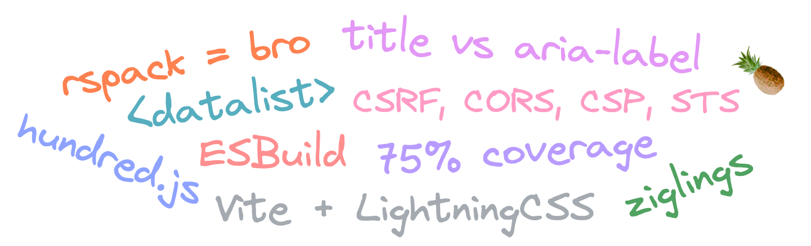

  

# Новые старые ссылки

## https://twitter.com/brillout/status/1649309673701482496

Не успел я оправиться от того, как в vite задумались над перформансом, так воскрес PR в котором пытаются избавиться от захардкоженного PostCSS и заменить его на LightningCSS. Следующее поколение Tailwind кстати тоже будет использовать его.

---

## https://twitter.com/ruiconti/status/1649904327627079681

В esbuild кстати тоже нашли узкое место для большого количества модулей (и уже починили). Когда используешь нативный язык код получается гораздо быстрее сам по себе, но это не значит, что нет места оптимизациям. А оптимизировать и профилировать какой-нибудь Go значительно проще, чем JS.

---

## https://www.yagiz.co/securing-your-nextjs-13-application

В вебе есть куча встроенных технологий, которые помогают сделать сайт более безопасным. Тут небольшой обзор на примере Next.js.

---

## https://www.a11yproject.com/posts/title-attributes/

Я уже проговорился в чате, что не всегда title это лучший выбор для доступности. Больше примеров и мнений можно глянуть [в комментах к посту Kent C. Dodds в твиттере](https://twitter.com/kentcdodds/status/1650571631184723968).

---

## https://www.quora.com/As-a-software-engineer-or-programmer-whats-the-dumbest-line-of-code-youve-seen-in-a-codebase/answer/Hariharan-136

Ставь глупые требования — получай хитрые решения.

---

## https://twitter.com/Una/status/1650586952981159942

Нативный тултип из комбинации новинок html и css. Подписывайся на Una за крутым контентом.

---

## https://twitter.com/cmuratori/status/1651310548380942337

Производительность важна и отговорки не помогут.

---

## https://twitter.com/aidenybai/status/1650406345517199361

Million.js теперь работает с Next.js. А вот как он работает под капотом [на примере простой реимплементации](https://twitter.com/aidenybai/status/1651072640650727424).

---

## https://twitter.com/inclusivepiney/status/1650817093074313223

Говорят первый русскоязычный подкаст о цифровой доступности. Темы я правда отчасти уже видел [в A11y дайждесте](https://www.notion.so/A11Y-ba9f0c717d7146e080a6d4a0beb44c9b#f8c27f2ba13b44f0be7dc06d1984fcb9)

---

## https://twitter.com/mysk_co/status/1651021165727477763

Google Authenticator научился сохранять и шарить секреты. Стоит ли включать и есть ли альтернативы?

---

## https://twitter.com/0xabad1dea/status/1651218817815572483

Один из гугловых датацентров в Европе промок. Не беда, весь все реплицировано, подумаешь ты, но как всегда в таких случаях бывает реальность оказалось суровой и кластер развалился, забрав с собой несколько зон.

---

## https://www.builder.io/blog/powerful-html-tags

В html есть куча тегов, которые пригодятся для мелочей и не только. Мой любимый из статьи — `<datalist>`.

---

## https://github.com/ratfactor/ziglings

Rustlings это один из лучших способов познакомиться с крабьим языком. но пока Foundation чудит можно попробовать таким же образом выучить Zig.

---

## https://ui.dev/why-react-renders

Ребята продолжают пиарить свой курс по реакту и выпустили статью о том, как работает рендер.

---

## https://twitter.com/patak_dev/status/1651593983418671106

Абсолютные гигачады из команды rspack нашли у себя проблему с HMR, починили, а потом пошли контрибьютить фикс похожей проблемы в vite.

---

## https://twitter.com/Mokkapps/status/1651632300453502979

Использовать Tailwind без плагина к prettier это преступление.
