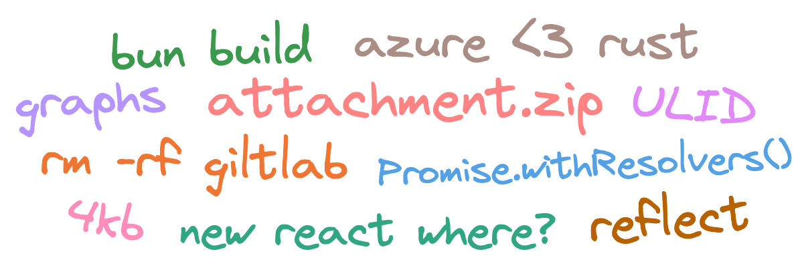

  

# Присмотрись к ссылке прежде чем кликнуть

> Сегодня в выпуске TS оптимизация, размеры страниц памяти, удаление гитлаба, новые домены, bun build, новости из TC39 и другое

## https://twitter.com/puruvjdev/status/1656511215001272323

Споры JSDoc vs TypeScript все не утихают, вот еще одна перспектива.

---

## https://twitter.com/lemire/status/1655581005799997443

Тред о том, что мы все застряли в прошлом со страничками памяти по 4kb. Тем временем на маках уже по 16, а под linux вообще можно включить странички по 2mb. Работать все будет гораздо быстрее, правда куча софта (по опыту asahi linux, которые пытаются запустить linux на apple silicon) просто сломается из-за ожидания определенного размера.

---

## https://twitter.com/yoshuawuyts/status/1657003064782405632

Не смотря на глупости, которыми занимается Foundation крабьего языка, он продолжает набирать обороты. Microsoft уже давно внедряют его чтобы фиксить уязвимости с памятью, а теперь они рассказывают о том, как делают свое облако безопаснее.

---

## https://youtu.be/tLdRBsuvVKc

Классическая история о том как гитлаб удалили базки из прода, теперь и в видео формате. В истории прекрасно просто все, если ты еще не знаешь про нее, то крайне рекомендую.

---

## https://twitter.com/Google/status/1653866291692728320

Google разрешили регать несколько новых доменов. В том числе и `.zip`. Хз кто это аппрувнул, жду не дождусь когда пользователь начнут скамить с помошью [https://attachment.zip](attachment.zip). Не веришь, что это проблема? Вот [еще пример](https://medium.com/@bobbyrsec/the-dangers-of-googles-zip-tld-5e1e675e59a5) того, как легко заставить тебя скачать что-то левое.

Думаешь люди умеют читать ссылки? Даже (ex-)гугл ребята знают что это нет так: [https://youtu.be/0-wB1VY3Nrc](https://youtu.be/0-wB1VY3Nrc).

---

## https://twitter.com/kettanaito/status/1656981827729383425

Мокать запросы довольно неприятное занятие, но MSW в этом отлично помогает, а в следующем релизе он станет более совмести со стандартными апишками.

---

## https://twitter.com/typescript/status/1657075057309679616

Команда TypeScript зарелизили плагин, который помогает найти деоптимизации и низкоуровневые проблемы с производительностью TS. Правда если ты спустился до уровня оптимизаций работы движка, то у меня для тебя плохие новости — надо было выбирать другой язык, а не стараться титаническими усилиями выжимать из JS капли перфоманса.

---

## https://youtu.be/nWIY7TfAa-U

Я люблю музыку и хорошие наушники (сижу сейчас в Moondrop Variations, btw). К сожалению в сфере очень много обмана, рекламы и глупых инфлюенсеров. К счастью есть crinacle, который занимается пожалуй одной из немногих объективных вещей в этом хобби — измеряет наушники и строит графики. А теперь он обновляет свою базу измерений на новом оборудовании.

---

## https://shopify.engineering/building-resilient-payment-systems

Строить большие системы трудно, всегда находятся места для улучшений. Вот как Shopify улучшали свою платежную систему. В одном из пунктов они кстати поменяли GUID-ы на ULID-ы и уменьшили в два раза время вставки транзакций в базку.

---

## https://twitter.com/buildWithLit/status/1658246469181407232

Lit готовят новую мажорную версию. Без новых фич, зато выпилили кучу легаси.

---

## https://twitter.com/aboodman/status/1658251815929126913

Ребята из Replicache теперь релизят продукт для построения мультиплеер приложений. Не нравится продукт? Зато можно позалипать в собирании пазла на лендосе.

---

## https://bun.sh/blog/bun-bundler

У bun теперь есть собственный бандлер. Быстрый! Получится ли им воспользоваться? Вряд ли, но больше конкуренции среди бандлеров это круто.

---

## https://blog.cloudflare.com/moderizing-cloudflare-pages-builds-toolbox/

CF Pages и Workers — топовое место для хостинга. Но вот их CI-CD пайплайн просто ржавое барахло. Настолько, что даже проще деплоить с Github Actions. Наконец-то они добрались до того, чтобы что-то исправить. Лень читать, но хочешь понять масштаб проблем? В этом релизе они подняли версию ноды с 12-й до 18-й.

---

## https://twitter.com/robpalmer2/status/1658914059578744835

`Promise.withResolvers()` протолкнули на следующую стадию TC35. У меня в проекте уже есть самописная реализация этого, а у тебя?

Вот [другие новости](https://twitter.com/robpalmer2/status/1659249289313255424) с этой встречи

---

## https://webkit.org/blog/14154/webkit-features-in-safari-16-5/

Safari 16.5, теперь с CSS Nesting и возможностью сломать себе все отключив кодеки.

---

## https://observablehq.com/@tmcw/days-between-react-releases

React давненько ничего официально не релизил (хотя это не мешает next.js релизить их фичи). Вот сколько дней обычно между релизами.
