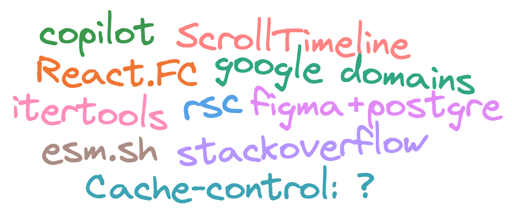

  

# Дэн в отпуске, реакт твиттер в опасности

> сегодня о: паттернах использования copilot, базке данных фигмы, скролл-анимациях, итераторах, опросе от stackoverflow, кешировании статики, RSC в vite и google domains.

## https://twitter.com/DynamicWebPaige/status/1667751396110909440

Кодо-ассистенты с нами уже крепко, но как они меняют повседневную разработку?

---

## https://www.figma.com/blog/how-figma-scaled-to-multiple-databases/

Оказывается фигма крутилась на одной большой старой доброй постгре. И только недавно набралось достаточно проблем чтобы начать что-то скейлить.

---

## https://twitter.com/adamwathan/status/1667549810792996868

В реакте сложно поулчить эргономичную композицию. Вот какие есть варианты.

---

## https://github.com/nilshartmann/react-server-component-material/blob/notes-on-rsc/notes-on-rsc.md

Очередной пост о том, что RSC это не серебрянная пуля, а специфичная технология для специфичных проблем. Жаль, что кор команда считает, что это "единственный благословленный способ использовать реакт"

---

## https://www.totaltypescript.com/you-can-stop-hating-react-fc

С тайпинга реакта всегда было куча проблем. Но теперь `React.FC` стал вполне себе ок.

---

## https://twitter.com/bramusblog/status/1668620414057336839

Анимации, зависящие от скролла, приедут в следующем релизе хрома. Вот несколько примеров.

---

## https://twitter.com/smooshMap/status/1668757522508025857

Пропоузал с методами итераторов уже в stage 3, и blink [уже готовятся шиппить](https://twitter.com/intenttoship/status/1669457984055902208).

---

## https://twitter.com/DasSurma/status/1668922915973214208

Есть пара CDN, которые повзовлят импортировать npm модули прямо в браузер. А этот умеет импортировать даже TS gist-ы с гитхаба!

---

## https://survey.stackoverflow.co/2023/

Результаты ежегодного опроса от stackoverflow. JavaScript все еще самый популяреный, а Rust все еще любят.

---

## https://simonhearne.com/2022/caching-header-best-practices/

Оказалось, что никто не понимает как нормально кешировать статику, вот неплохое начало.

---

## https://twitter.com/nkSaraf98/status/1667934636297650179

RSC все еще nextjs-only фича, но вот PR чтобы добавить поддержку в vite (и во все фрейморки на нем)

---

## https://newsroom.squarespace.com/blog/googledomains

Помните были такие Google Domains? Те, что подарили нам .zip. Почему были? Да потому что не нужно привязываться к продуктам гугла.
