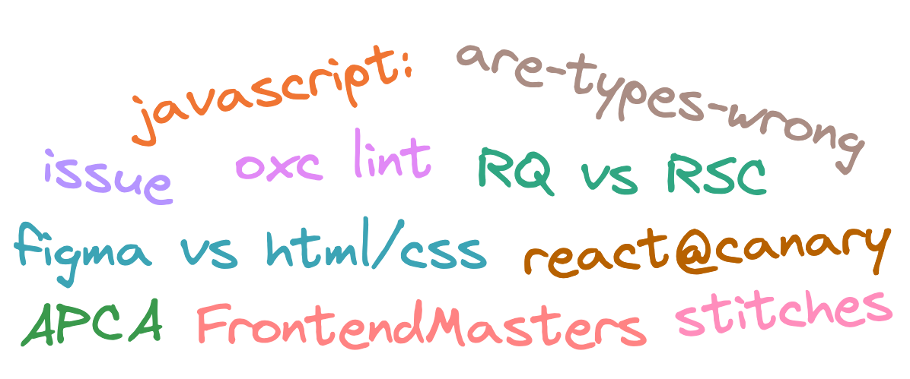

    

# Не недели без драмы в твиттере

> Внутри: issue здорового человека, быстрый сайт без фреймворков, закладки в закладках, RSC продолжают ломать библиотеки, новый линтер, драма с канареечных реактом, stitches все, че с типами в библиотечках, контраст это не просто, и дизайнеры из будущего (прошлого).

## https://antfu.me/posts/why-reproductions-are-required#failing-test-cases

Контрибьютить в опенсорс сложно. Но можно помочь любимому проекты заведя хороший issue по встретившейся проблеме. Anthony Fu давненько написал статью о том, что такое классный issue и как помочь мейнтенеру и себе пофиксить проблему. А сейчас он обновил свой гайд одним полезным трюком — хочешь чтобы твою проблему починили быстрее? Законтрибьють на нее падающие тесты.

---

## https://twitter.com/1Marc/status/1672709140588924928

Помимо классного контента у FrontendMasters есть еще и классный сайт. Быстрый, удобный, и без кучи проблем современных фронтендов на раздутых фреймворках. Лень читать комменты на linkedin (кто вообще считает это приличной соцсетью, кек)? [Зацени статью напрямую](https://frontendmasters.com/blog/vanilla-javascript-todomvc/). В ней куча полезной инфы, о том, что фреймворки часто только мешаются и чем сложнее фреймворк, тем хуже у тебя получится конечный продукт.

---

## https://twitter.com/PiotrSzlachciak/status/1672341501005778945

Мастерство скаммеров всегда прокачивается. Не буду спойлерить детали, скажу лишь, что наверное не стоит добавлять рандомные ссылки в закладки.

---

## https://twitter.com/TkDodo/status/1673401744087195657

Хочешь поиспользовать react-query в проекте с RSC? Жизнь не так проста и все развалится в самых непредсказуемых местах.

---

## https://twitter.com/boshen_c/status/1673361615377551370

eslint очень тяжелый и неповоротливый. Я был очень рад, когда ребята из Rome начали пилить альтернативу. Вот только время идет, а проект не особо движется. С тех пор мелькал rsint, а теперь вот и oxc хочет обзавестить своим линтером. Скоуп у него специально ограничен только проверками корректности, так что может затея и не выгорит.

---

## https://twitter.com/FredKSchott/status/1673342700651704330

Очередная драма с участием next.js и их канареечной зависимости от реакта. Я на стороне Фреда, все новые фичи в next, в том числе и app router не стоит считать production ready. Я думаю всем должно быть очевидно, что тулза, которая зависит от канареечной версии реакта не сможет волшебным образом стать стабильной, а куча вспомогательных частей вокруг нее и вовсе не готовы (server actions, формы, да и куча всего).

Ты конечно можешь поверить [инфлюенсерам которые релизят кучу проектов](https://twitter.com/t3dotgg/status/1673343428820697089) (и имеют vercel в спонсорах), но я бы держался от новой шляпы в nextjs подальше.

Как было сделать правильнее? Очевидно не нужно называть неготовые вещи стабильными и не нужно ломать совместимость в патчевых версиях. Как добиться того, чтобы люди начали этим пользоваться? Проще простого, нужно было просто зарелизить react 19 и next 14 и ни у кого бы не возникало вопросов со стабильностью и обратной совместимостью.

---

## https://twitter.com/xirclebox/status/1673557143088242689

Внезапно в очередной раз всплыл холивар о tailwind. Я думал все уже давно успокоились и поняли, что это классный инструмент, который помогает уменьшить количество лапши в стилях. У меня в проекте поди сотни классов которые можно было легко заменить на tailwind и жить припеваючи. Одних только `display: flex` 276 штук, да и в стилях еле разберешься.

---

## https://github.com/stitchesjs/stitches/discussions/1149

react безжалостно убивает css-in-js решения. Вот и ребята из stitches решили, что смысла поддерживать его дальше нет. Хорошо, что я держался подальше от всей css-in-js шляпы. Как же сейчас писать css? Попробуй комбинацию из tailwind и обычных стилей там, где его не хватает.

---

## https://twitter.com/mattpocockuk/status/1673971796238901249

Релизишь какую-нибудь библиотечку с типами? Думал уже поведал все боли commonjs, es modules, и разных бандлеров? Но нет, теперь нужно повторить все то же самое для типов. К счастью есть тулза, которая поможет разобраться со всем бардаком из типов и модулей в тайпскрипт.

---

## https://twitter.com/MyndexResearch/status/1673711302697701381

Если ты только начал свой путь в доступности, то тебе может показаться, что померять контраст текста легко. Но на самом деле тут легко ошибиться использовав неудачную метрику. В хроме кстати тоже по умолчанию используется AA/AAA, а что такое APCA и как его включить [https://web.dev/color-and-contrast-accessibility/](можно прочитать у их дерврелов).

---

## https://opensource.googleblog.com/2023/06/rust-fact-vs-fiction-5-insights-from-googles-rust-journey-2022.html

Мне нравится rust, но вокруг него есть куча мифов. Интересная статистика от гугла (за 2022 год) об использовании rust среди их разработчиков. Забавно, что даже ребята в гугле учат новые языки решая задачки Advent of Code, рекомендую!

---

## https://world.hey.com/dhh/design-for-the-web-without-figma-4bc3a218

Figma все больше похожа на реальную верстку в браузере. Дизайнеры, которые хотят развиваться, будут все больше погружаться в авто-лейауты, переменные, и условия. Но язык, на котором все это происходит очень многословен и неуклюж, а среда далека от настоящего браузера. К счастью, решение уже давно есть.

В стартапах крутые дизайнеры пилят макеты под веб сразу в браузере на html и css. Дизайнер, который понимает как все работает в реальной верстке и сталкивается с ограничениями сможет сделать продукт лучше, чем дизайнер, который живет в своем изолированном мире, расставляет отступы руками, и топит за пискель-перфект верстку.
